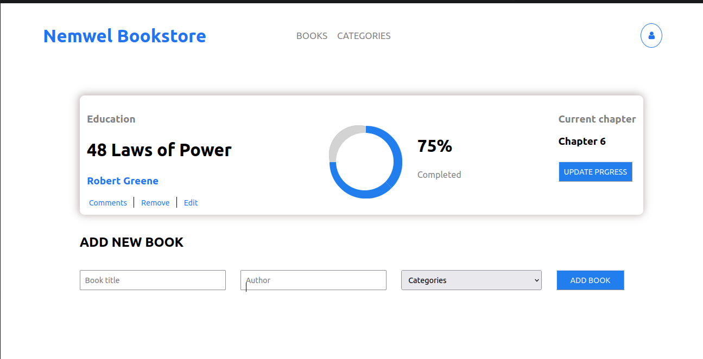

# Nemwel Bookstore

Nemwel Bookstore is a simple CRUD application for listing books built with React and Redux. It posts and retrieved books information from an API.
It currently allows you to:
- Add a new book allowing you to specify a book's:
  - Author
  - Title
  - Genre
- Remove a specific book from the list
Enjoy!

## Built With

- HTML5
- CSS
- Javascript
- React
- Redux
- API
- Webpack
- Linters

## Live Demo

This project was deployed to two places:
- [Netlify](https://papaya-biscochitos-303a27.netlify.app/)
- [Heroku]() none at the moment

## Getting Started

To get a local copy up and running follow these simple example steps.

## Install

In your terminal, navigate to your current directory and run this code

`git@github.com:Nemwel-Boniface/nemwelbookstore.git`

Locate the directory in your file explorer

`cd nemwelbookstore`

Install npm or if installed already using this link

`npm install`

Start the web dev server depending on your configuration

`npm start`

The Project should now be live on your browser

## Authors

👤 **Author1**

- GitHub: [@Nemwel-Boniface ](https://github.com/Nemwel-Boniface)
- Twitter: [@nemwel_bonie](https://twitter.com/nemwel_bonie)
- LinkedIn: [LinkedIn](https://www.linkedin.com/in/nemwel-nyandoro-aa1b2620b/)

Contributions, issues, and feature requests are welcome!

Feel free to check the [issues page](https://github.com/Nemwel-Boniface/nemwelbookstore/issues).

## Show your support

Give a ⭐️ if you like this project!
## 📝 License

This project is [MIT](./MIT.md) licensed.
